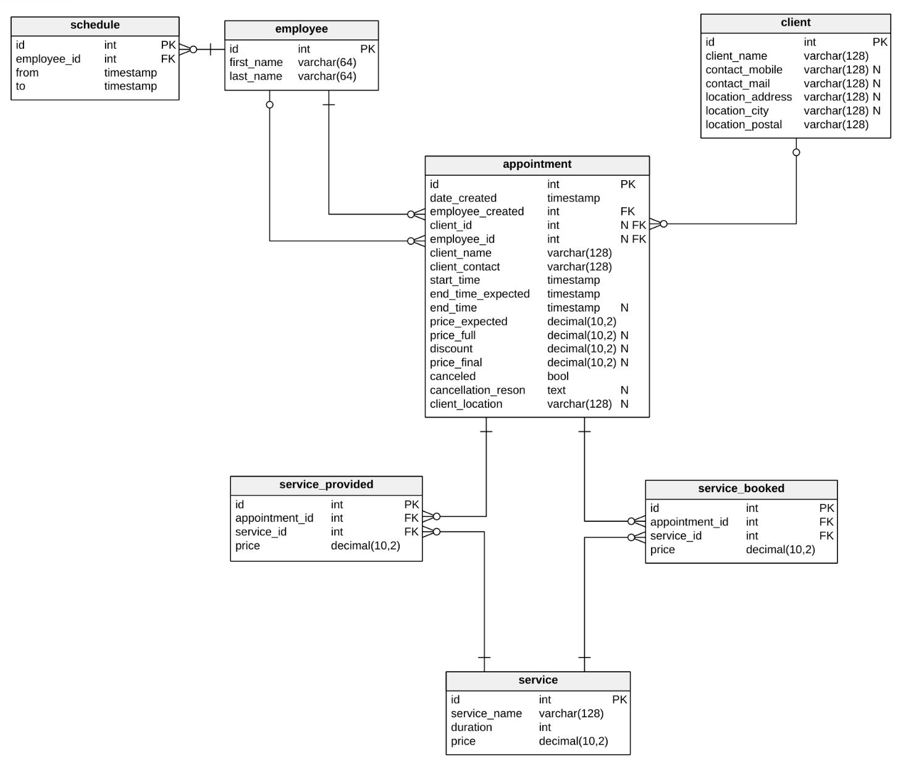

# Repair MIV
Repo for minimal appointment scheduling application
## DB Schema

=======
# Repair MIV

Service Request lifecycle:
1. Init -> client form submission
2. Submission -> dispatcher finalizes, approves
3. Fulfillment -> tech receives appointment, completes services
4. Payment -> client receives price, submits payment
5. Confirmation -> dispatcher confirms payment receipt, approves finalized submission
6. Storage -> component unmounted, stored in database

### Elements:
- Administrative:
  - schedule
  - employee

- Client

- Appointment

- Service Objects:
  - service
  - service_provided
  - service_book

### Pages:
URLS:
* tech.${BASE_URL}      // used for tech API
* admin.${BASE_URL}     // used for admin dashboard
* dispatch.${BASE_URL}  // dispatcher url

Login:
  - User
  - Employee
  - Admin

Public:
  - main: landing, describes services
  - services: service listings, sorted by category

Private:
  - Dispatcher: form handling, received from client

Tech:
  - Incoming service request, received from dispatcher

### TODOS:
- [x] Create skeleton

- [ ] Create API
  - [ ] Admin objects
    - [ ] schedule
    - [ ] employee
  - [ ] Client object
  - [ ] Appointment objects
    - [ ] GET methods
    - [ ] POST methods
      - [ ] Create appointment
    - [ ] Put methods
      - [ ] Cancel appointment
    - [ ] Delete methods
      - [ ] Delete appointment
  - [ ] Services Objects
    - [ ] service_provided
    - [ ] service_booked
    - [ ] service

- [ ] Create Mail server
  - [ ] Setup Ubuntu server
  - [ ] Postfix

- [ ] Create UI
  - [ ] Client
    - [ ] Landing Page
    - [ ] Service Selections
    - [ ] Contact Page
  - [ ] Employee
  - [ ] Admin
  - [ ] Mail
